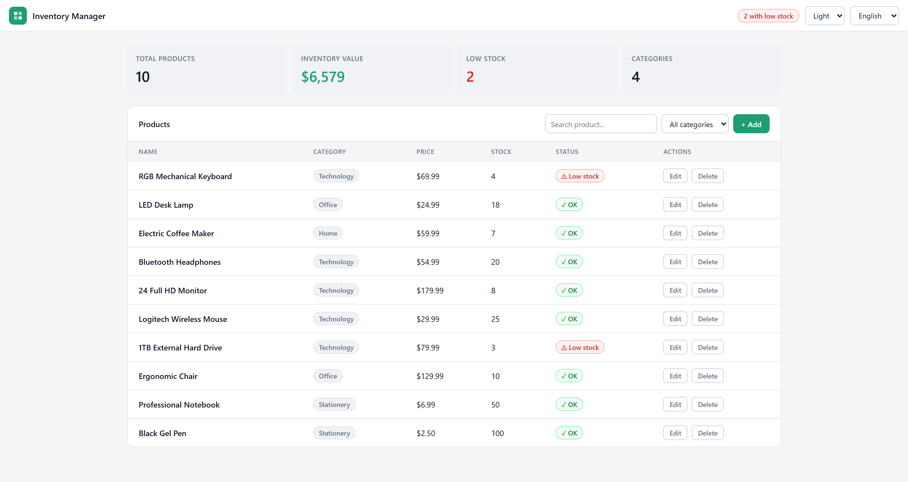
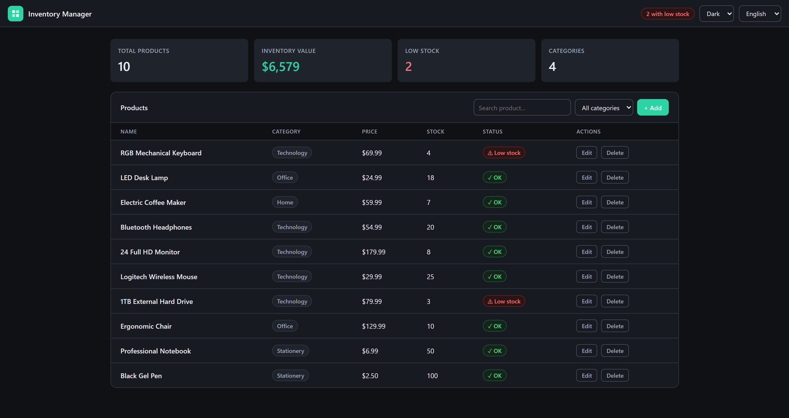

# Inventory Manager

A small web application for organizing products and categories, aimed at businesses that need a straightforward inventory overview. The project is free to use and consists of a **Spring Boot** REST API backed by **PostgreSQL** and a **static frontend** (HTML, CSS, JavaScript) that talks to the API over HTTP.

---

## Technologies

| Layer | Stack |
|--------|--------|
| Backend | Java **21**, Spring Boot, Spring Data JPA, Maven |
| Database | **PostgreSQL** |
| Frontend | Vanilla HTML, CSS, JavaScript (no build step required) |
| API testing | Postman (or any HTTP client) |

---

## Prerequisites

Before you run anything, install and verify:

1. **JDK 21** — the backend targets Java 21 (`pom.xml`).
2. **Apache Maven** — or use the included Maven Wrapper in `backend/` (`mvnw` / `mvnw.cmd` on Windows).
3. **PostgreSQL** — a running server you can connect to (local or remote).

---

## 1. Database setup

1. Create an empty database for the app, for example:

   ```sql
   CREATE DATABASE inventory_db;
   ```

2. Open `backend/src/main/resources/application.properties` and set:

   - `spring.datasource.url` — JDBC URL pointing at your PostgreSQL instance and database name.
   - `spring.datasource.username` / `spring.datasource.password` — credentials for that database.

   **Security:** Do not commit real production passwords. Use local values only, or externalize secrets (environment variables, a private `application-local.properties` ignored by Git, etc.).

3. On first run, Hibernate is configured with `spring.jpa.hibernate.ddl-auto=update`, so tables are created or updated automatically from your entities.

---

## 2. Run the backend (API)

From the repository root:

```bash
cd backend
```

**Windows:**

```cmd
mvnw.cmd spring-boot:run
```

**macOS / Linux:**

```bash
./mvnw spring-boot:run
```

If you prefer a system Maven install:

```bash
mvn spring-boot:run
```

When the application starts successfully, the API listens on **port 8080** by default (`server.port=8080`).

### REST API (overview)

Base URL: `http://localhost:8080`

| Resource | Prefix |
|----------|--------|
| Products | `/api/products` |
| Categories | `/api/categories` |

Typical operations: `GET` (list / by id), `POST`, `PUT /{id}`, `DELETE /{id}`. The product controller also exposes extra routes such as low-stock and category reports under `/api/products/...` — see the controllers in `backend/src/main/java/.../controllers/` for exact paths.

You can use **Postman** or `curl` to create categories and products before or while using the UI.

---

## 3. Run the frontend

The UI lives in `frontend/index.html`. It expects the API at:

```text
http://localhost:8080/api
```

(this is defined at the top of the script block in `index.html` as `const API = '...'`).

### Option A — Open the file directly

Double-click `frontend/index.html` or open it from the browser (**File → Open**).  
Note: some browsers restrict `fetch()` from `file://` URLs to `http://localhost`. If the page shows a connection error, use Option B or configure CORS on the backend so the browser allows cross-origin requests from your dev origin.

### Option B — Serve the folder over HTTP (recommended for local development)

From the `frontend` directory, any static file server works, for example:

```bash
cd frontend
npx --yes serve -p 3000
```

Then open `http://localhost:3000` (or the URL printed in the terminal). The UI will call `http://localhost:8080` for the API; if the browser blocks those requests, enable **CORS** in Spring Boot for your frontend origin, or serve the static files from the same host/port as the API.

---

## 4. How to use the application (UI)

1. **Start PostgreSQL**, then **start the Spring Boot app**, then **open the frontend** as above.
2. **Dashboard metrics** — totals, inventory value, low-stock count, and number of categories update from loaded data.
3. **Products** — search, filter by category, add / edit / delete products. Stock status is highlighted when quantity is at or below the minimum.
4. **Categories** — manage categories from the same screen (when the add-product overlay is open, the categories panel is available there as well).
5. **Add / edit product** — opens a modal form. You can close it with **Cancel**, the **×** button, **Escape**, or by clicking the **dimmed backdrop** outside the dialog.
6. **Theme** — switch **light** or **dark** mode (preference is stored in the browser).
7. **Language** — switch **Spanish** or **English** for the interface strings (stored in the browser).

If the backend is not running, the UI shows a clear error message and reminds you that the API should be available at `localhost:8080`.

---

## Screenshots





---

## Project layout (short)

```text
inventory/
├── backend/          # Spring Boot application (Maven)
│   └── src/main/
├── frontend/         # Static SPA (index.html, assets under public/)
└── README.md
```

---

## Troubleshooting

| Problem | What to check |
|---------|----------------|
| API will not start | JDK 21, PostgreSQL running, database exists, URL and credentials in `application.properties`. |
| UI says it cannot connect | Backend running on port 8080, firewall, and correct `API` URL in `frontend/index.html`. |
| Browser blocks API calls | CORS: either serve the frontend from the same origin as the API or add a CORS policy for your dev server URL. |

---

## License / usage

This project is intended to be free to use for organizing inventory. Adjust configuration and deployment to match your own security and infrastructure requirements.
